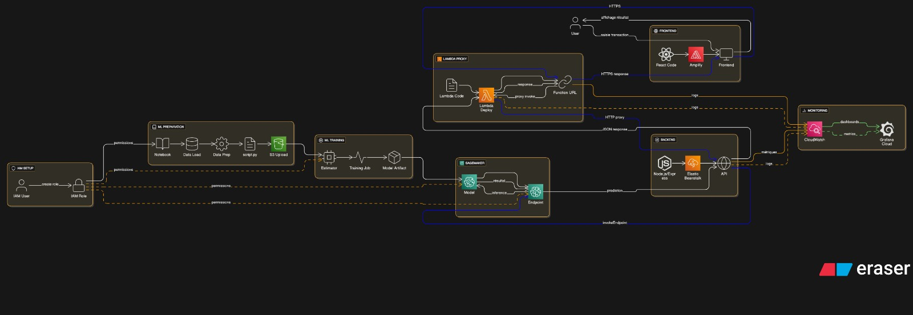
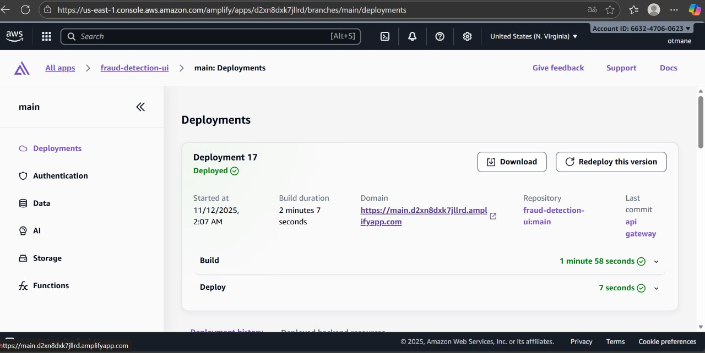
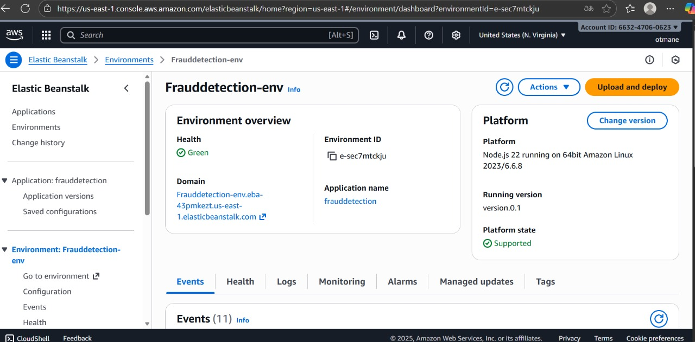
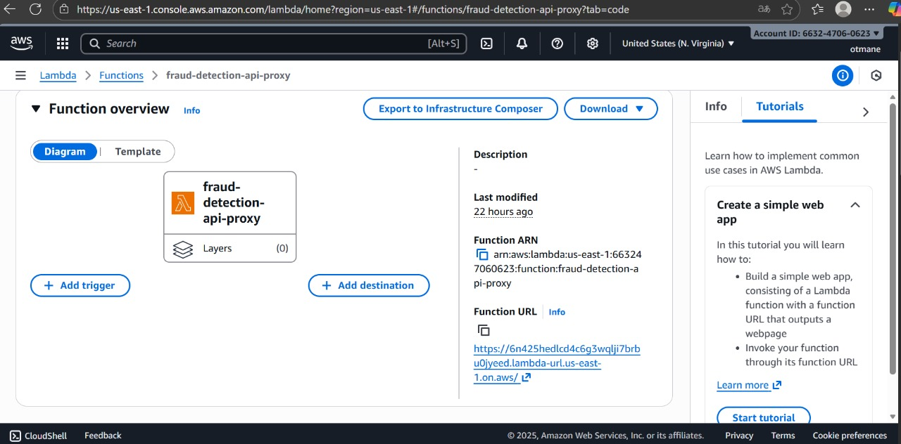
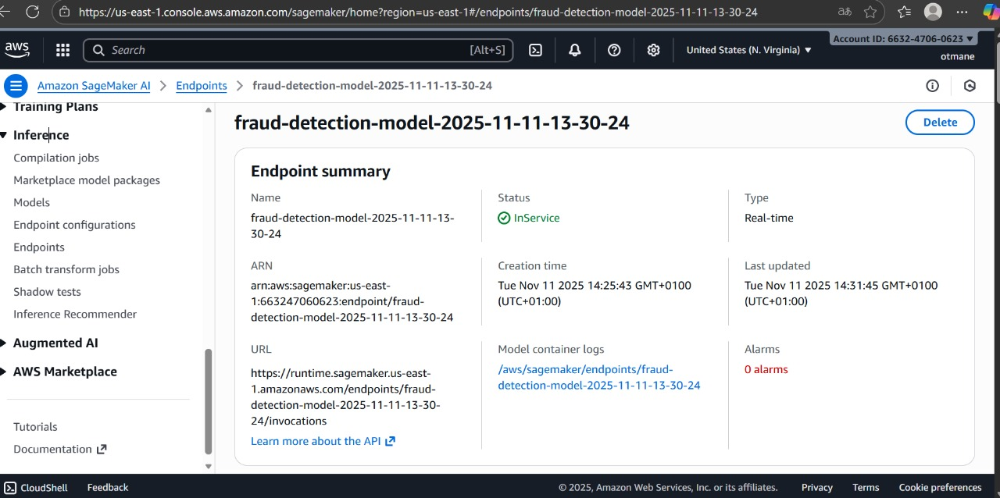
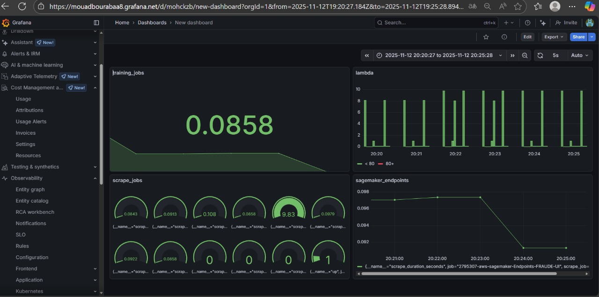

# Fraud Detection System
A comprehensive, cloud-native fraud detection system built on AWS infrastructure, featuring real-time machine learning predictions, a modern React UI, and full monitoring capabilities.

📋 **Table of Contents**
- [Architecture Overview](#-architecture-overview)
- [System Components](#-system-components)
  - [Frontend - AWS Amplify](#frontend---aws-amplify)
  - [Backend - AWS Elastic Beanstalk](#backend---aws-elastic-beanstalk)
  - [API Gateway - AWS Lambda](#api-gateway---aws-lambda)
  - [Machine Learning - AWS SageMaker](#machine-learning---aws-sagemaker)
  - [Storage - Amazon S3](#storage---amazon-s3)
  - [Monitoring - Grafana](#monitoring---grafana)
- [Local Development Setup](#-local-development-setup)
- [Deployment Guide](#-deployment-guide)
- [Project Structure](#-project-structure)
- [Technologies Used](#-technologies-used)
- [API Documentation](#-api-documentation)
- [System Metrics](#-system-metrics)

---

## 🏗️ Architecture Overview
The system is designed using a **microservices architecture** fully deployed on AWS cloud infrastructure. This ensures **scalability, reliability**, and **real-time fraud detection** capabilities.



**Data Flow Overview:**
1. **User Interface** → React application hosted on AWS Amplify  
2. **API Layer** → AWS Lambda function URL / API Gateway  
3. **Application Logic** → Node.js backend running on Elastic Beanstalk  
4. **ML Inference** → Real-time predictions via SageMaker endpoint  
5. **Monitoring** → Grafana dashboards track system metrics and performance  

---

## 🎯 System Components

### Frontend - AWS Amplify
The **React-based UI** provides a seamless and responsive interface for monitoring and detecting fraud.



**Key Features:**
- Real-time fraud prediction and probability visualization
- Transaction analytics dashboard
- Responsive design for mobile and desktop
- Automatic deployments triggered on Git push

**Deployment Details:**
- Status: Successfully deployed (Deployment 17)
- Domain: [https://main.d2xn8dxk7jllrd.amplifyapp.com](https://main.d2xn8dxk7jllrd.amplifyapp.com)
- Repository: Connected to GitHub (`fraud-detection-ui:main`)
- Last Deployment: November 12, 2025

---

### Backend - AWS Elastic Beanstalk
Handles **business logic, data processing**, and communication with the SageMaker ML models.



**Configuration:**
- Environment: Frauddetection-env
- Platform: Node.js 22 on 64bit Amazon Linux 2023/6.6.8
- Health Status: Green ✅
- Domain: [Frauddetection-env.eba-43pmkezt.us-east-1.elasticbeanstalk.com](https://Frauddetection-env.eba-43pmkezt.us-east-1.elasticbeanstalk.com)

**Features:**
- RESTful API endpoints with request validation
- Integration with SageMaker endpoints for inference
- Error handling, logging, and auto-scaling

---

### API Gateway - AWS Lambda
AWS Lambda serves as a **serverless API proxy**, enabling low-latency HTTP requests handling.



**Function Details:**
- Name: `fraud-detection-api-proxy`
- Runtime: Node.js / Python
- Function URL: [https://6n425hedlcd4c6g3wqljj7brbu0jyeed.lambda-url.us-east-1.on.aws/](https://6n425hedlcd4c6g3wqljj7brbu0jyeed.lambda-url.us-east-1.on.aws/)

**Advantages:**
- Pay-per-request pricing
- Automatic scaling and fault tolerance
- Zero server management
- Low latency response times

---

### Machine Learning - AWS SageMaker
SageMaker manages the **training and deployment of ML models** for fraud detection.

**SageMaker Endpoint:**


- Name: `fraud-detection-model-2025-11-11-13-30-24`
- Status: InService ✅
- Type: Real-time inference
- Endpoint URL: `https://runtime.sagemaker.us-east-1.amazonaws.com/endpoints/fraud-detection-model-2025-11-11-13-30-24/invocations`

**Training Jobs:**

- Algorithm: Random Forest (RF)
- Optimized for real-time predictions
- Regular retraining pipeline for model updates

---

### Storage - Amazon S3
Amazon S3 stores **training data, model artifacts, and deployment assets** securely.


**Buckets Overview:**
- `deployment-s3-bucket-sagemaker` → SageMaker deployment artifacts  
- `elasticbeanstalk-us-east-1-663247060623` → Backend application versions  
- `sagemaker-us-east-1-663247060623` → SageMaker training data and models  

**Security & Management:**
- Private bucket access
- Encryption at rest
- Versioning enabled
- Lifecycle policies for data retention

---

### Monitoring - Grafana
Real-time monitoring and observability are provided via **custom Grafana dashboards**.



**Monitored Metrics:**
- SageMaker endpoint status and latency  
- Lambda invocation counts and error rates  
- Training job durations and resource utilization  

**Features:**
- Real-time alerts and notifications
- Custom query capabilities
- Auto-refresh every 5 seconds

---

## 💻 Local Development Setup

**Prerequisites:**
- Node.js 18+ or 22+  
- Python 3.8+  
- AWS CLI configured  
- Git  

**Installation Steps:**
```bash
git clone https://github.com/Bourabaa/fraud-detection.git
cd fraud-detection

# Frontend setup
cd fraud-detection-ui
npm install

# Backend setup
cd ../fraud-detection-backend
npm install

# Configure environment variables in .env
AWS_REGION=us-east-1
SAGEMAKER_ENDPOINT=fraud-detection-model-2025-11-11-13-30-24
PORT=3000
NODE_ENV=development

# Run frontend
cd ../fraud-detection-ui
npm start

# Run backend
cd ../fraud-detection-backend
npm run dev
